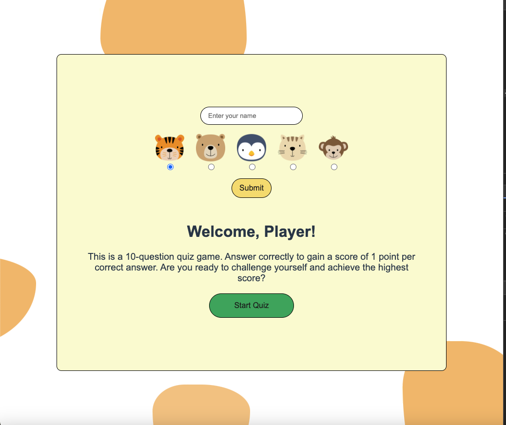
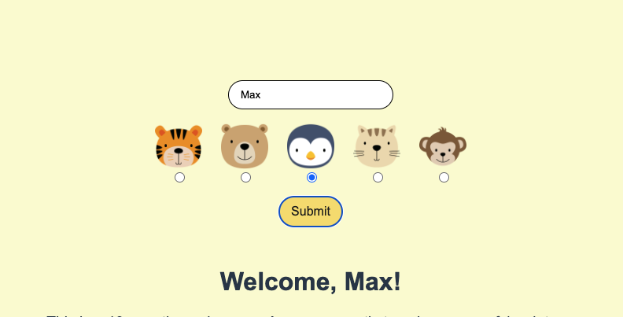
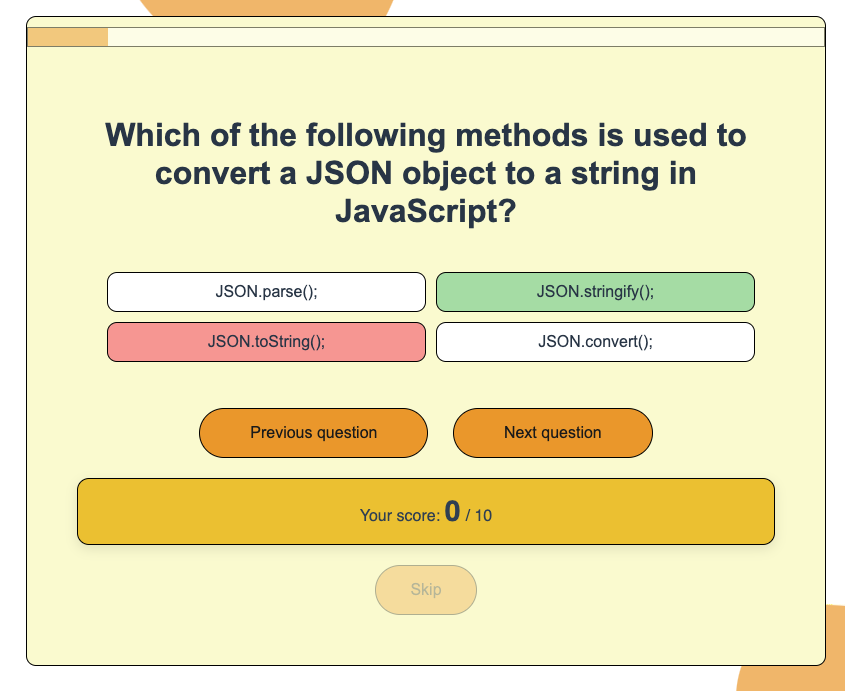
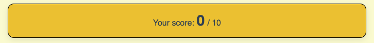
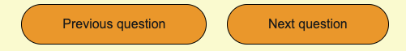
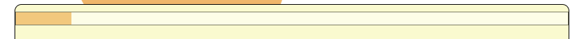
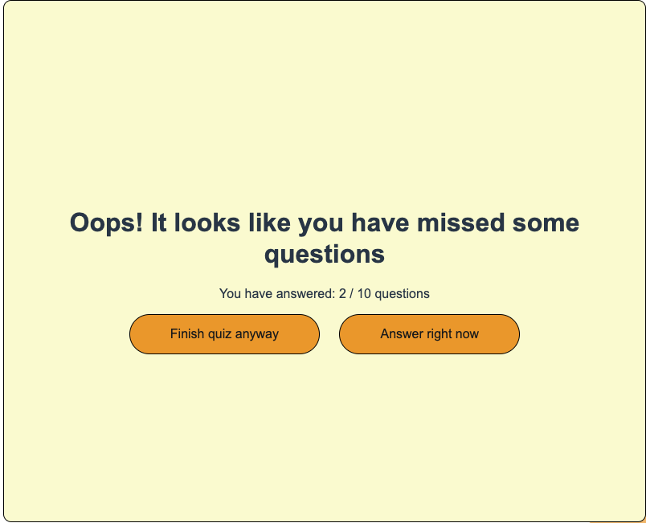
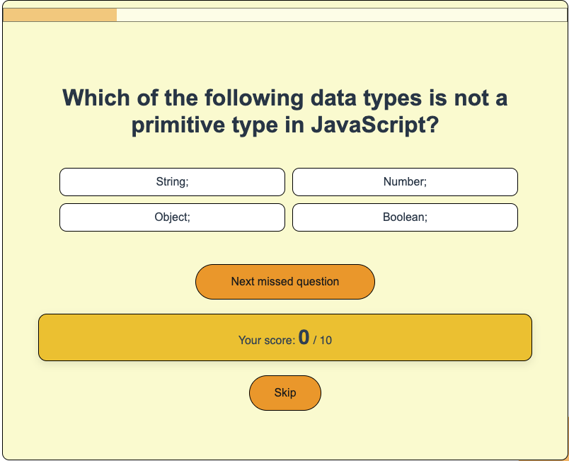
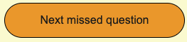
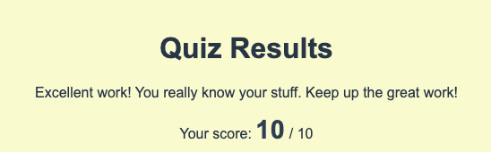

# Quiz App

A quiz application consisting of 10 questions with 3-4 answer options. You can test your knowledge of JavaScript.

You can view the application here:
[quiz app](https://durw4rd.github.io/browsers-quiz-project/)

## Tech Stack

- HTML
- CSS
- Vanilla JS

## Usage

### Welcome Page

The app’s starting page, where the user is greeted and given the option to start the quiz.

- **Basic Features:**

  - Greeting the user
  - Button to start the quiz

- **Additional Features:**
  - Option to add the user's name and choose an avatar
    

### Question Page

The core functionality of the app where users answer questions and earn points.

- **Basic Features:**

  - Ability to select one of the answer options
  - Check if the answer is correct and see the correct answer if the response was incorrect
  - View the score (+1 point for each correct answer)

    

- **Additional Features:**

  - Option to skip a question and see the correct answer using the "Skip" button without affecting the score (if the user has already answered the question, the button is disabled)

    

  - Navigate forward and backward through the quiz questions without answering

    

  - If the user has answered a question, the given answer is displayed during navigation.
  - When the page is reloaded, progress is not lost, and the user is taken to the question where the reload occurred (with the answer data and score preserved).
  - View current progress through a progress bar that updates with each answer

  

  - Once the final question is reached, a "Finish Quiz" button appears, which checks if the user has answered all 10 questions (since navigation allows the user to skip questions without answering)

### Finish Quiz Page

An additional feature of the app. This page only appears if the user has not answered all 10 questions.

- **Additional Features:**

  - If the user hasn’t answered all 10 questions, a page appears showing the number of answered questions, along with two options: finish the quiz anyway or return to the skipped questions.
  - Choosing the "Finish Quiz Anyway" option leads the user to the quiz results page.
  - Choosing the "Answer right now" option navigates only to the pages with skipped questions.

  

  - Navigation buttons disappear, but a "Next Skipped Question" button appears, or "Finish Quiz" if no more questions are left.

  

### Results Page

The page that displays the quiz results.

- **Basic Features:**
  - After completing the quiz, the user sees the results page.
  - Option to restart the quiz.
